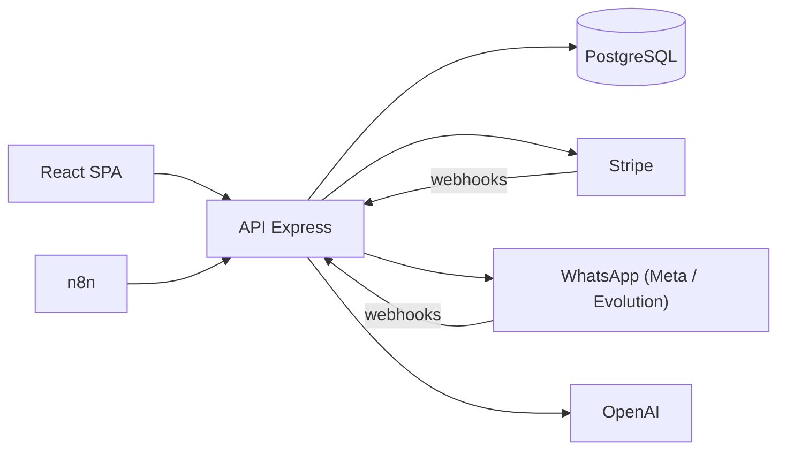

# InsurPro

Sistema de gestão para corretoras de seguros (CRM/ERP), em produção com clientes reais.

Site: https://app.insurpro.com.br
Empresa: IntegraTech — https://www.integra-tech.site

O código-fonte é proprietário e fica em repositório privado da empresa. Este repositório existe para documentar o projeto e o que eu faço nele.

## O que é o sistema

O InsurPro é usado por corretoras de seguros para tocar a operação comercial do dia a dia:

- Funil de leads em Kanban, com scoring e distribuição automática entre corretores
- Cadastro de clientes e segurados (PF e PJ), apólices, propostas e documentos
- Cálculo automático de comissões, com metas por corretor e por equipe
- Contas a receber e controle de inadimplência
- Assistente de IA (SOFIA) que responde perguntas sobre os dados da corretora em linguagem natural, gerando as consultas SQL por trás
- Notificações e lembretes por WhatsApp para corretores e clientes
- Assinatura SaaS com trial de 14 dias e cobrança recorrente pelo Stripe

## Stack

| Camada | Tecnologias |
|---|---|
| Frontend | React 18, TypeScript, Vite, TailwindCSS, shadcn/ui, TanStack Query |
| Backend | Node.js, Express, TypeScript |
| Banco | PostgreSQL com Drizzle ORM |
| IA | OpenAI (chat com tools, NL-SQL, RAG com embeddings) |
| Pagamentos | Stripe (assinaturas e webhooks) |
| Mensageria | WhatsApp (Meta Cloud API e Evolution API), n8n |
| Infra | Docker, Traefik com SSL automático, VPS Linux |

## Arquitetura

O sistema é multi-tenant: cada corretora tem seus dados isolados por tenant_id em todas as consultas, com perfis de acesso diferentes (admin, corretor, produtor) e um painel separado de super admin para administrar a plataforma.

Alguns pontos do projeto que acho interessantes tecnicamente:

- A SOFIA transforma perguntas tipo "quais clientes estão inadimplentes há mais de 30 dias?" em SQL validado e escopado por tenant
- Base de conhecimento de seguros com busca semântica (embeddings + RAG)
- Integração WhatsApp com dois providers: o sistema decide por tenant se usa Meta Cloud API ou Evolution, respeitando a janela de 24h da Meta e caindo para template aprovado quando ela fecha
- Billing com webhooks idempotentes do Stripe e período de carência antes de suspender inadimplentes
- Ambientes de DEV e PROD separados em containers, com deploy por script

## Minha atuação

Trabalho no InsurPro pela IntegraTech, mais focado em back-end e banco de dados:

- Escrevo e otimizo consultas SQL no PostgreSQL para relatórios, KPIs e diagnóstico de dados
- Criei scripts de correção e migração de dados de produção (apólices, comissões, usuários)
- Desenvolvo endpoints REST na API Express com TypeScript e Drizzle ORM
- Desenvolvo telas e componentes no front-end com React, TypeScript, TailwindCSS e shadcn/ui
- Montei automações no n8n integrando o sistema ao WhatsApp
- Acompanho deploys via Docker e logs de produção

## Contato

rafaellima151204@gmail.com
https://linkedin.com/in/rafael-lima-matos
